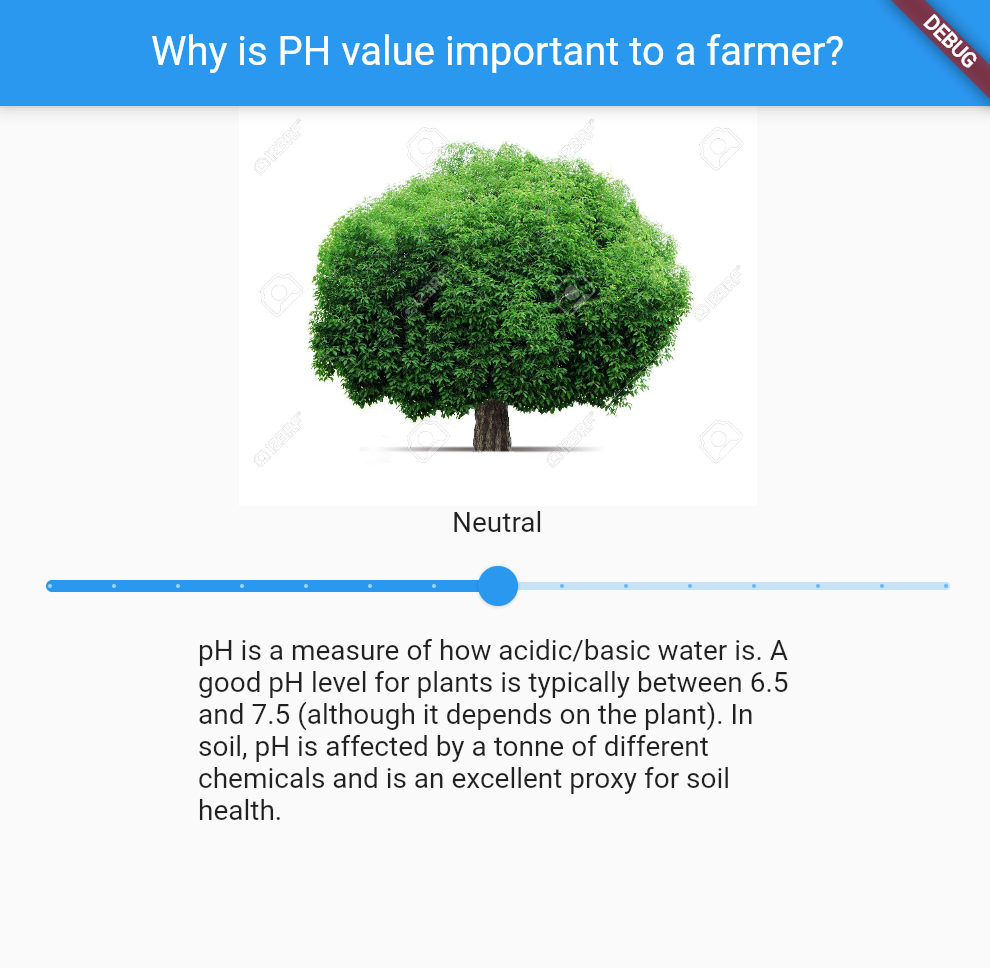
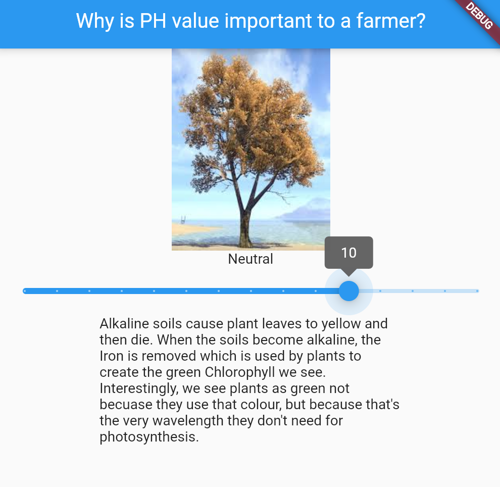
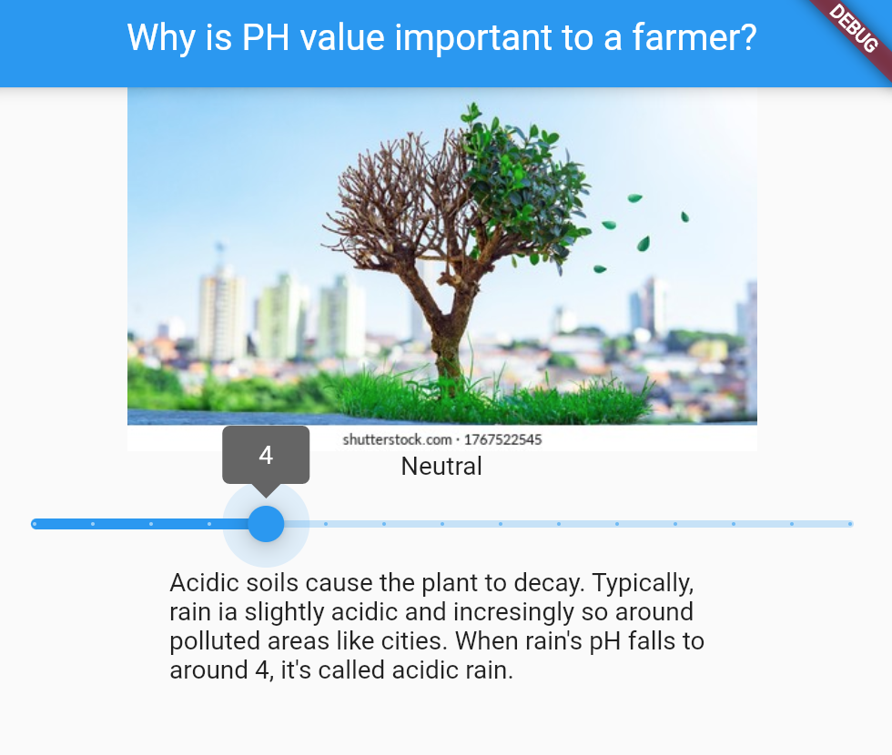

# Flutter-pH-App

## Getting Started

Try it out here on flutlab:
https://api.flutlab.io/res/projects/355354/zfehoijjr6hud2sqcafq/index.html#/

This app teaches people about the importance of pH. Built using flutter and includes dynamic elements. 

